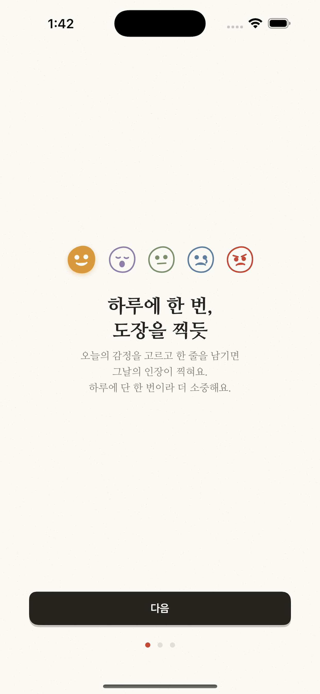
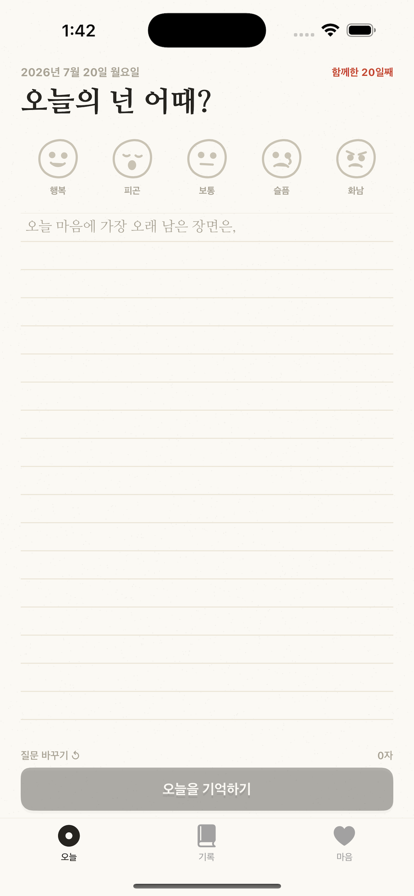
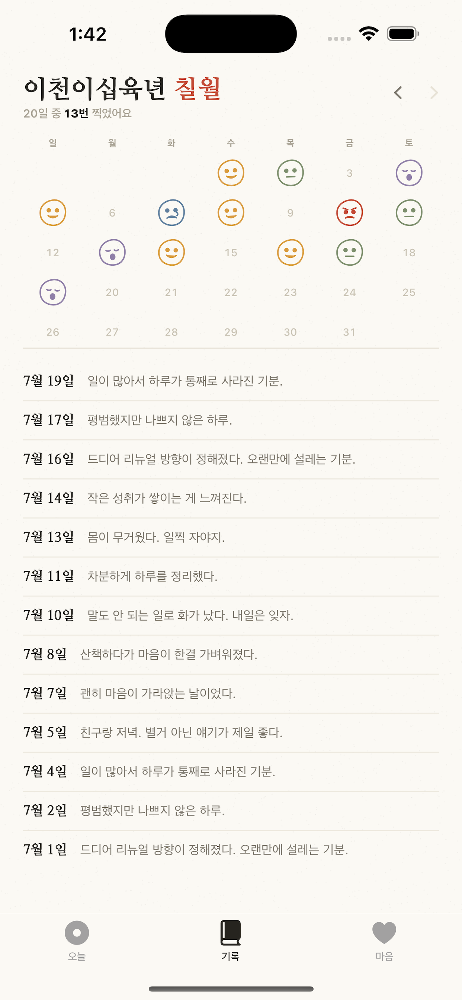
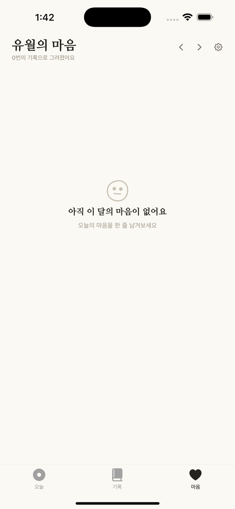

# Re:ToU (오늘의 넌)

하루 한 줄, 감정을 도장으로 찍는 감정 회고 iOS 앱입니다. 한지(韓紙) 위에 낙관을 찍듯 오늘의 감정을 기록하고, 한 달의 마음을 조각보로 돌아봅니다.

[](https://apps.apple.com/kr/app/re-tou/id6745058969)

- 플랫폼: iOS 18.2+ / iPhone·iPad / 100% SwiftUI
- 저장: SwiftData + CloudKit 동기화 (iCloud 불가 시 로컬 폴백)
- 외부 의존성: 없음
- 2025.04 v1.0 출시 → 2026.07 v2.0 한지 테마 전면 개편

| 온보딩 | 오늘 | 자취 | 마음결 |
|:---:|:---:|:---:|:---:|
|  |  |  |  |

## 주요 기능

- **하루 한 회고** — 하루 1건 제한을 UI가 아니라 데이터 계층에서 강제
- **감정 도장** — 이모지가 아닌 커스텀 벡터 낙관(도장) 5종, 4가지 렌더 상태
- **조각보 통계** — 월별 감정 분포를 차트 라이브러리 없이 조각보 형태로 직접 렌더링, 주된 감정에 따른 편지 메시지
- **잠금** — Face ID 우선, 실패 시 앱 내 6자리 PIN 패드 (Keychain 저장)
- **iCloud 동기화 / CSV 내보내기 / 지난 오늘(1년 전 회고) / 리마인더 알림**
- 한국어·영어 지역화

## 아키텍처

```
View → ReflectionStorage(ObservableObject) → ReflectionUseCase → Repository → SwiftData
```

- 뷰는 `ModelContext`를 직접 만지지 않고, 비즈니스 규칙(감정 필수, 내용 필수, 하루 1건)은 Domain/Data 계층에서 강제합니다.
- 실패 가능한 연산은 전부 `Result<T, ReflectionError>`로 반환 — 에러 타입이 개발자용 메시지와 사용자용 메시지, 심각도를 함께 운반합니다.
- `LaunchView`는 잠금 → 온보딩 → 메인의 3단계 상태 머신입니다.

```
ReToU/
├── Models/        Reflection(@Model), EmotionType, ReflectionError, ModelContainer
├── Data/          SwiftDataReflectionRepository
├── Domain/        ReflectionUseCase (규칙 강제 + 레거시 마이그레이션)
├── ViewModels/    ReflectionStorage
├── Views/         Today · Records · Mind + Components(EmotionSeal, Jogakbo, PinPad)
├── Managers/      AuthManager, ReminderManager
└── Utilities/     DesignSystem, SafeDateManager, KeychainHelper, CSVExporter …
```

## 엔지니어링 노트

**한지 테마는 에셋이 아니라 코드입니다.** `DesignSystem.swift`가 한지의 질감을 절차적으로 그립니다 — `PaperGrain`은 Canvas로 발(簾) 자국(3pt 간격 0.5pt 선)과 닥섬유 입자를 뿌리고, `TornRectShape`는 찢은 종이 모서리를, `InkButtonShape`는 비대칭 코너의 도장 형태 버튼을 만듭니다. 이미지 에셋 없이 어떤 크기에서도 같은 질감이 나옵니다.

**무작위처럼 보이지만 결정론적입니다.** 시드 기반 LCG(`SeededRandom`)로 각 날짜의 도장 기울기를 날짜 키에서 유도합니다. 같은 날의 도장은 앱을 다시 켜도 항상 같은 각도로 기울어져 있습니다.

**날짜 버그를 구조로 방지합니다.** 모든 날짜 범위 연산을 `SafeDateManager` 한 곳에 모으고 반열림 구간 `[start, end)` 규약을 강제해, 월말 기록 누락 같은 경계 버그를 원천 차단합니다. 타임존 변경도 호출 시점마다 재동기화합니다.

**v1 → v2 데이터 마이그레이션.** v1의 UserDefaults JSON 기록을 SwiftData로 이관하되, 원본을 바로 지우지 않고 7일 유예 기간 후에만 자동 정리합니다. "레거시 데이터 없음"과 "디코딩 실패"를 구분해 처리합니다.

**CloudKit 제약을 모델 설계에 반영.** 모든 속성에 기본값을 두는 CloudKit 요건을 지키면서, 컨테이너 초기화 실패 시 로컬 전용 모드로 폴백해 iCloud 없이도 앱이 항상 뜹니다. 현재 모드는 설정 화면에 표시됩니다.

**알림은 반복 1개가 아니라 14일치 개별 스케줄.** 앱을 열 때마다 창을 앞으로 밀며, 이미 회고를 쓴 날은 그날 알림을 건너뜁니다.

**소소한 것들** — CSV는 UTF-8 BOM을 붙여 엑셀 한글 깨짐을 방지하고, 한국어 문어체 날짜(`한 해... 서른한 날`, 해오름달~매듭달)를 직접 구현했으며, App Store 스크린샷은 DEBUG 런치 아규먼트(`-SeedDemoData 1`)로 데모 데이터를 시딩해 재현 가능하게 캡처합니다.

## 빌드

```bash
open ReToU.xcodeproj
```

Xcode 16+ / iOS 18.2 SDK. 외부 의존성이 없어 바로 빌드됩니다. (iCloud 동기화는 개인 팀 서명으로도 로컬 폴백 모드로 동작합니다.)

## 사용자 지원

FAQ, 개인정보 처리방침, 문의는 [SUPPORT.md](SUPPORT.md)를 확인해 주세요.
