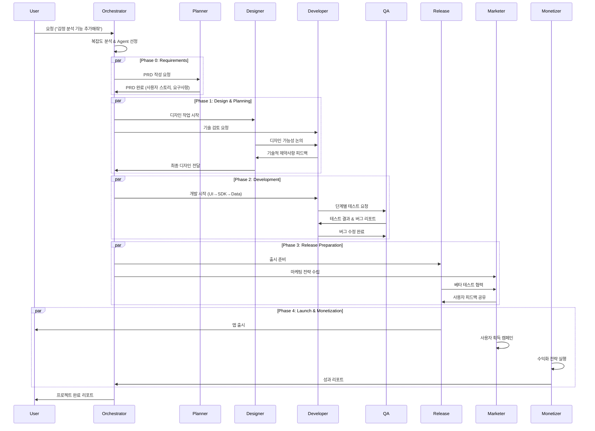

# 🤝 Agent 협업 워크플로우

## 🔄 전체 협업 구조



## 📋 단계별 협업 프로토콜

### **Phase 0: 요구사항 분석** 
```yaml
Participants: Orchestrator → Planner
Duration: 0.5-1 day
Deliverables: PRD, 기능 명세서, 사용자 스토리

Workflow:
  1. Orchestrator_Analysis:
     - 사용자 요청 복잡도 평가 (1-10점)
     - 필요 Agent 식별 및 우선순위 결정
     - 프로젝트 스코프 및 제약사항 정의
     
  2. Planner_Requirements:
     - 상세 요구사항 분석 및 PRD 작성
     - 사용자 스토리 및 유스케이스 정의
     - 비즈니스 목표 및 성공 지표 설정
     - 경쟁 분석 및 차별화 포인트 도출
     
  3. Quality_Gate:
     - PRD 완성도 90% 이상
     - 모호한 요구사항 0개
     - 측정 가능한 성공 지표 정의
     - 이해관계자 승인 완료

Communication_Protocol:
  Kickoff_Meeting:
    - 프로젝트 목표 및 범위 공유
    - 예상 일정 및 마일스톤 설정
    - 각 Agent 역할 및 책임 명확화
    
  Daily_Standup:
    - 진행사항 및 블로커 공유 (10분)
    - 다음 24시간 계획 공유
    - Agent 간 의존성 이슈 해결
```

### **Phase 1: 설계 및 디자인**
```yaml
Participants: Designer ↔ Developer (병렬 작업)
Duration: 1-2 days  
Deliverables: 디자인 시스템, 와이어프레임, 기술 아키텍처

Designer_Workflow:
  1. Research_Phase:
     - 사용자 리서치 및 경쟁 분석
     - 디자인 컨셉 및 방향성 설정
     - 브랜드 가이드라인 검토
     
  2. Design_Phase:
     - 정보 구조 및 사용자 플로우 설계
     - 와이어프레임 및 프로토타입 제작
     - 고충실도 UI 디자인 완성
     - 디자인 시스템 컴포넌트 정의
     
  3. Validation_Phase:
     - 사용성 테스트 및 피드백 수집
     - 접근성 및 가이드라인 준수 검증
     - Developer와 구현 가능성 논의

Developer_Workflow:
  1. Architecture_Design:
     - 기술 스택 선정 및 아키텍처 설계
     - 데이터 모델 및 API 설계
     - 성능 및 확장성 고려사항 분석
     
  2. Technical_Validation:
     - 디자인 구현 복잡도 평가
     - 외부 SDK 및 API 연동 가능성 검토
     - 플랫폼 제약사항 및 대안 제시
     
  3. Implementation_Planning:
     - 개발 단계별 작업 계획 수립
     - 테스트 전략 및 CI/CD 파이프라인 설계
     - 위험 요소 식별 및 완화 방안 준비

Collaboration_Points:
  Design_Review_Sessions:
    - Daily: 진행사항 공유 및 이슈 논의 (30분)
    - Mid-point: 중간 리뷰 및 방향성 조정 (1시간)
    - Final: 최종 승인 및 핸드오프 (1시간)
    
  Technical_Feasibility_Check:
    - 복잡한 인터렉션 구현 가능성 검토
    - 성능 최적화 관점에서 디자인 조정
    - 플랫폼별 차이점 및 대응 방안 논의
```

### **Phase 2: 개발 및 테스트**
```yaml
Participants: Developer → QA (순차적 협업)
Duration: 3-5 days
Deliverables: 구현 완료된 기능, 테스트 리포트

Development_Sub_Phases:
  Phase_2A_UI_Development:
    Duration: 1-2 days
    Tasks:
      - SwiftUI 기반 사용자 인터페이스 구현
      - 디자인 시스템 코드 변환
      - 반응형 레이아웃 및 다크모드 지원
      - 기본 내비게이션 및 화면 전환
    
    QA_Involvement:
      - UI 컴포넌트 단위 테스트
      - 디자인 스펙 대비 픽셀 퍼펙트 검증
      - 다양한 디바이스 레이아웃 테스트
      - 접근성 기능 동작 확인
  
  Phase_2B_SDK_Integration:
    Duration: 1 day
    Tasks:
      - 외부 라이브러리 및 프레임워크 통합
      - Apple 플랫폼 API 연동 (HealthKit, Core ML)
      - 써드파티 SDK 설정 및 최적화
      - 권한 관리 및 보안 구현
    
    QA_Involvement:
      - API 연동 기능 테스트
      - 권한 요청 플로우 검증
      - 에러 처리 시나리오 테스트
      - 보안 취약점 스캔
  
  Phase_2C_Data_Integration:
    Duration: 1-2 days
    Tasks:
      - SwiftData 모델링 및 데이터베이스 설정
      - 백엔드 API 연동 및 네트워킹
      - 데이터 캐싱 및 오프라인 지원
      - 동기화 및 충돌 해결 로직
    
    QA_Involvement:
      - 데이터 CRUD 기능 테스트
      - 네트워크 상태별 동작 검증
      - 데이터 동기화 시나리오 테스트  
      - 성능 및 메모리 사용량 모니터링

Quality_Assurance_Protocol:
  Testing_Strategy:
    Unit_Tests:
      - 개별 함수 및 메서드 단위 테스트
      - 비즈니스 로직 검증
      - 커버리지 85% 이상 목표
    
    Integration_Tests:
      - 컴포넌트 간 상호작용 테스트
      - API 연동 및 데이터 플로우 검증
      - 시나리오 기반 테스트 수행
    
    UI_Tests:
      - 사용자 인터페이스 자동화 테스트
      - 주요 사용자 플로우 검증
      - 회귀 테스트 자동화
  
  Bug_Management:
    Severity_Classification:
      Critical (P0): 앱 크래시, 기본 기능 불가
      High (P1): 주요 기능 오동작
      Medium (P2): 사용성 이슈, 성능 문제
      Low (P3): 마이너한 UI 이슈
    
    Resolution_SLA:
      P0: 즉시 (4시간 이내)
      P1: 1일 이내  
      P2: 3일 이내
      P3: 다음 마이너 업데이트
```

### **Phase 3: 출시 준비**
```yaml
Participants: Release Manager + Marketer (병렬 작업)
Duration: 1-2 days
Deliverables: 출시 준비 완료, 마케팅 캠페인 설계

Release_Manager_Tasks:
  App_Store_Preparation:
    - 앱스토어 메타데이터 작성 및 최적화
    - 스크린샷 및 앱 프리뷰 영상 제작 협조
    - 개인정보 보호 정보 및 연령 등급 설정
    - 베타 테스트 그룹 설정 (TestFlight)
  
  Technical_Preparation:
    - 배포 환경 설정 및 검증
    - 앱 서명 및 인증서 관리
    - 단계적 출시 계획 수립
    - 롤백 시나리오 및 대응책 준비
  
  Quality_Assurance:
    - 최종 빌드 품질 검증
    - 스토어 정책 준수 확인
    - 성능 벤치마크 테스트
    - 보안 및 개인정보보호 감사

Marketer_Tasks:
  Market_Research:
    - 타겟 오디언스 분석 및 페르소나 정의
    - 경쟁 환경 분석 및 포지셔닝 전략
    - 키워드 리서치 및 ASO 최적화
    - 가격 전략 및 수익화 모델 검증
  
  Campaign_Planning:
    - 런칭 캠페인 전략 수립
    - 콘텐츠 마케팅 계획 (블로그, SNS)
    - 인플루언서 및 파트너십 발굴
    - 프레스 릴리즈 및 미디어 키트 준비
  
  Creative_Development:
    - 마케팅 크리에이티브 제작 (배너, 영상)
    - 소셜 미디어 콘텐츠 계획
    - 앱스토어 최적화 에셋 (ASO)
    - 사용자 온보딩 가이드 제작

Beta_Testing_Collaboration:
  Internal_Testing:
    - 팀 내부 강도 높은 테스트
    - 실제 사용 환경에서 스트레스 테스트
    - 다양한 디바이스 호환성 검증
  
  External_Beta:
    - 타겟 사용자 그룹 베타 테스트
    - 피드백 수집 및 우선순위 분류
    - 크리티컬 이슈 신속 수정
    - 사용자 경험 개선사항 도출
```

### **Phase 4: 출시 및 수익화**
```yaml
Participants: Release Manager + Marketer + Monetizer (협업)
Duration: 지속적 (런칭 후 모니터링)
Deliverables: 앱 출시, 사용자 획득, 수익 창출

Launch_Execution:
  Soft_Launch:
    - 제한된 지역/사용자 대상 출시
    - 실시간 성능 모니터링
    - 사용자 피드백 수집 및 대응
    - 서버 부하 및 안정성 검증
  
  Full_Launch:
    - 전체 마켓 대상 정식 출시
    - 마케팅 캠페인 동시 실행
    - 미디어 커버리지 및 PR 활동
    - 커뮤니티 및 고객 지원 시작

User_Acquisition:
  Organic_Growth:
    - 앱스토어 최적화 (ASO) 지속 개선
    - 콘텐츠 마케팅 및 SEO 전략
    - 소셜 미디어 유기적 확산
    - 입소문 및 추천 프로그램
  
  Paid_Acquisition:
    - Apple Search Ads 캠페인 운영
    - 소셜 미디어 광고 (Instagram, TikTok)
    - 인플루언서 마케팅 파트너십
    - 크로스 프로모션 및 제휴 마케팅

Monetization_Strategy:
  Revenue_Streams:
    - 프리미엄 구독 모델 (월/연 단위)
    - 인앱 구매 (고급 기능, 컨텐츠)
    - 타겟 광고 (사용자 동의 기반)
    - 기업 B2B 라이센싱
  
  Optimization_Tactics:
    - A/B 테스트를 통한 가격 최적화
    - 사용자 세그멘테이션 기반 개인화
    - 리텐션 캠페인 및 재참여 유도
    - 고객 생애 가치 (LTV) 극대화

Success_Metrics_Tracking:
  User_Metrics:
    - DAU/MAU (일간/월간 활성 사용자)
    - 사용자 리텐션율 (1일, 7일, 30일)
    - 세션 길이 및 앱 사용 깊이
    - 유기적 vs 유료 사용자 획득 비율
  
  Business_Metrics:
    - 앱스토어 순위 및 다운로드 수
    - 수익 및 ARPU (사용자당 평균 수익)
    - 고객 확보 비용 (CAC) 대 생애 가치 (LTV)
    - 구독 전환율 및 해지율
  
  Technical_Metrics:
    - 앱 성능 지표 (크래시율, 응답시간)
    - 서버 안정성 및 가용성
    - 에러율 및 사용자 지원 티켓 수
    - 보안 인시던트 및 대응 시간
```

## 🚨 위기 상황 대응 프로토콜

### **긴급 상황별 대응 체계**
```yaml
Crisis_Management:
  Critical_Bug_Response:
    Level_1_Detection: (자동 모니터링 또는 사용자 리포트)
      - QA Agent: 즉시 재현 및 영향도 분석
      - Developer Agent: 긴급 투입 및 원인 파악
      - Orchestrator: 대응 우선순위 및 리소스 배정
    
    Level_2_Resolution: (4시간 이내)
      - 임시 해결책 (hotfix) 적용
      - 사용자 커뮤니케이션 (투명한 상황 공유)
      - 근본 원인 분석 및 장기 대책 수립
    
    Level_3_Prevention: (완료 후)
      - 포스트모템 보고서 작성
      - 재발 방지 프로세스 개선
      - 모니터링 및 알러트 시스템 강화

  Security_Incident_Response:
    Immediate_Actions:
      - 보안팀 즉시 소집 및 상황 평가
      - 영향 범위 파악 및 격리 조치
      - 관련 기관 신고 (필요시)
    
    User_Protection:
      - 사용자 데이터 보호 조치
      - 투명한 커뮤니케이션 및 가이드 제공
      - 필요시 앱 사용 중단 권고
    
    Recovery_Process:
      - 보안 패치 개발 및 배포
      - 시스템 보안 강화
      - 제3자 보안 감사 수행

  PR_Crisis_Management:
    Negative_Reviews_Surge:
      - 리뷰 패턴 분석 및 핵심 이슈 파악
      - 신속한 고객 지원 및 이슈 해결
      - 개선사항 커뮤니케이션 및 이미지 회복
    
    Competition_Response:
      - 경쟁사 동향 분석 및 대응 전략 수립
      - 차별화 포인트 강화 및 마케팅 조정
      - 제품 로드맵 우선순위 재검토
```

## 📊 성과 측정 및 개선

### **협업 효율성 측정**
```yaml
Collaboration_Metrics:
  Process_Efficiency:
    - 평균 프로젝트 완료 시간
    - Agent 간 핸드오프 지연 시간
    - 재작업률 (rework rate)
    - 의사결정 소요 시간
  
  Quality_Indicators:
    - 최종 결과물 만족도 점수
    - 사용자 피드백 긍정 비율
    - 버그 발견 시점 (개발 중 vs 출시 후)
    - 성공 지표 달성률
  
  Communication_Effectiveness:
    - 정보 전달 정확도
    - 미팅 효율성 점수
    - 충돌 해결 소요 시간
    - 팀 만족도 지수

Continuous_Improvement:
  Retrospective_Sessions:
    - 주간 팀 회고 (What went well/What to improve)
    - 프로젝트 완료 후 포스트모템
    - 프로세스 개선 제안 및 실행
  
  Best_Practice_Sharing:
    - 성공 사례 문서화 및 공유
    - 실패 사례 학습 및 예방책 수립
    - 업계 트렌드 및 새로운 방법론 도입
  
  Skill_Development:
    - Agent별 전문성 강화 계획
    - 크로스 트레이닝 및 다기능 역량 개발
    - 최신 기술 및 도구 학습
```

**궁극적 목표**: 각 Agent의 전문성을 최대한 활용하면서도 원활한 협업을 통해 사용자 요청을 신속하고 고품질로 실현하는 자동화된 개발 파이프라인 구축