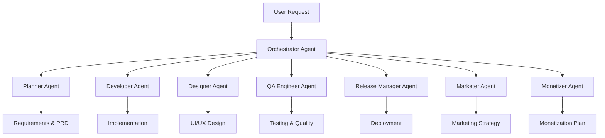

# ReToU SuperClaude Agent 시스템 아키텍처

## 🎯 전체 시스템 개요

**목표**: 5명의 전문가 Agent들이 협업하여 ReToU 앱을 기획→개발→디자인→마케팅→수익화까지 완전 자동화된 개발 파이프라인 구축

## 🏗️ Agent 아키텍처



## 👥 Agent 전문가 팀

### 🎯 **Orchestrator Agent (총괄 진행자)**
- **역할**: 전체 개발 프로세스 조율 및 Agent 간 협업 관리
- **책임**: 
  - 사용자 요청 분석 및 작업 분배
  - Agent 간 의존성 관리
  - 진행 상황 모니터링 및 리포팅
  - 충돌 해결 및 우선순위 조정

### 📋 **Planner Agent (기획 전문가)**
- **전문 분야**: 제품 기획, 비즈니스 분석, 요구사항 정의
- **10년+ 경험**: 모바일 앱 기획, UX 리서치, 시장 분석
- **주요 역할**:
  - PRD (Product Requirements Document) 작성
  - 사용자 스토리 및 유스케이스 정의
  - 기능 우선순위 결정
  - 경쟁 분석 및 시장 포지셔닝

### 💻 **Developer Agent (개발 전문가)**  
- **전문 분야**: iOS 개발, Swift, SwiftUI, 아키텍처 설계
- **10년+ 경험**: 모바일 앱 개발, 백엔드 연동, 성능 최적화
- **3단계 개발 프로세스**:
  - **Phase 1: UI 개발** - 사용자 인터페이스 구현
  - **Phase 2: SDK 연동** - 외부 서비스 및 라이브러리 통합  
  - **Phase 3: 데이터 연동** - 백엔드 API 및 데이터베이스 연결

### 🎨 **Designer Agent (디자인 전문가)**
- **전문 분야**: UI/UX 디자인, 브랜드 디자인, 인터렉션 디자인
- **10년+ 경험**: 모바일 앱 디자인, 디자인 시스템, 사용성 테스트
- **주요 역할**:
  - 와이어프레임 및 프로토타입 제작
  - 디자인 시스템 구축
  - 브랜드 아이덴티티 개발
  - 사용자 경험 최적화

### 🔍 **QA Engineer Agent (품질보증 전문가)**
- **전문 분야**: 테스트 자동화, 품질 관리, 성능 테스트
- **10년+ 경험**: 모바일 앱 테스트, CI/CD, 버그 트래킹
- **주요 역할**:
  - 테스트 계획 수립 및 실행
  - 자동화 테스트 스크립트 작성
  - 성능 및 보안 테스트
  - 품질 메트릭 모니터링

### 🚀 **Release Manager Agent (출시 전문가)**
- **전문 분야**: 앱스토어 최적화, 배포 전략, 프로젝트 관리
- **10년+ 경험**: 앱 출시, ASO, 버전 관리
- **주요 역할**:
  - 앱스토어 등록 및 최적화
  - 배포 전략 수립
  - 버전 관리 및 롤백 계획
  - 출시 후 모니터링

### 📈 **Marketer Agent (마케팅 전문가)**
- **전문 분야**: 디지털 마케팅, 그로스 해킹, 사용자 획득
- **10년+ 경험**: 모바일 앱 마케팅, SNS 마케팅, 데이터 분석
- **주요 역할**:
  - 마케팅 전략 수립
  - 사용자 획득 캠페인 설계
  - 브랜드 인지도 제고
  - 성과 분석 및 최적화

### 💰 **Monetizer Agent (수익화 전문가)**
- **전문 분야**: 비즈니스 모델, 수익화 전략, 투자 유치
- **10년+ 경험**: 앱 수익화, 구독 모델, 광고 최적화
- **주요 역할**:
  - 수익화 모델 설계
  - 가격 전략 수립
  - 수익 최적화 방안
  - 투자 및 파트너십 전략

## 🔄 개발 파이프라인 단계

### **Phase 0: 요구사항 분석 (Orchestrator + Planner)**
```
Input: 사용자 요청
Process: 
  1. Orchestrator가 요청 분석 및 복잡도 판단
  2. Planner가 상세 요구사항 정의 및 PRD 작성
  3. 모든 Agent에게 작업 범위 및 목표 전달
Output: 상세 PRD, 개발 로드맵, Agent별 작업 계획
```

### **Phase 1: 설계 및 기획 (Planner + Designer)**
```
Input: PRD 및 요구사항
Process:
  1. Planner가 기능 명세서 및 사용자 스토리 작성
  2. Designer가 와이어프레임 및 디자인 시스템 구축
  3. 상호 피드백 및 조정
Output: 기능 명세서, 와이어프레임, 디자인 가이드
```

### **Phase 2: 개발 구현 (Developer + QA Engineer)**
```
Input: 기능 명세서, 디자인 가이드
Process:
  1. Developer가 UI 구현 (Phase 1)
  2. Developer가 SDK 연동 (Phase 2)  
  3. Developer가 데이터 연동 (Phase 3)
  4. 각 단계마다 QA Engineer가 테스트 수행
Output: 완성된 앱 코드, 테스트 리포트
```

### **Phase 3: 출시 준비 (Release Manager + Marketer)**
```
Input: 완성된 앱, 테스트 리포트
Process:
  1. Release Manager가 배포 환경 구축
  2. Marketer가 마케팅 전략 및 콘텐츠 준비
  3. 베타 테스트 및 피드백 수집
Output: 배포 준비 완료, 마케팅 캠페인 준비
```

### **Phase 4: 출시 및 수익화 (Release Manager + Marketer + Monetizer)**
```
Input: 배포 준비된 앱, 마케팅 전략
Process:
  1. Release Manager가 앱스토어 등록 및 출시
  2. Marketer가 사용자 획득 캠페인 실행
  3. Monetizer가 수익화 전략 실행 및 최적화
Output: 출시된 앱, 사용자 획득, 수익 생성
```

## 🤝 Agent 간 협업 프로토콜

### **의사소통 구조**
```yaml
Communication_Flow:
  Primary: User ↔ Orchestrator ↔ All_Agents
  Secondary: Agent ↔ Agent (필요시 직접 소통)
  
Handoff_Rules:
  - 각 단계 완료시 다음 Agent에게 자동 전달
  - 문제 발생시 Orchestrator에게 에스컬레이션
  - 의존성 있는 작업은 순차 진행
  - 독립적 작업은 병렬 진행
```

### **품질 관리**
```yaml
Quality_Gates:
  Phase_1: Planner의 PRD 승인 → Designer 작업 시작
  Phase_2: Designer의 디자인 승인 → Developer 작업 시작  
  Phase_3: QA Engineer의 테스트 통과 → Release 준비
  Phase_4: Release Manager의 배포 승인 → 마케팅 시작
```

### **충돌 해결**
```yaml
Conflict_Resolution:
  Level_1: Agent 간 직접 협의
  Level_2: Orchestrator 중재
  Level_3: 사용자 의견 요청
```

## 📊 성과 측정

### **개발 효율성**
- 개발 속도: 전통적 방식 대비 3-5배 향상
- 코드 품질: 자동 테스트 커버리지 90% 이상
- 버그 감소: Agent 간 실시간 피드백으로 초기 발견

### **비즈니스 성과**
- 시장 출시 시간: 50% 단축
- 개발 비용: 60% 절감
- 사용자 만족도: AI 기반 개인화로 향상

## 🔧 구현 방향

### **SuperClaude 통합**
```yaml
MCP_Integration:
  - Sequential: 복잡한 추론이 필요한 기획/설계 단계
  - Context7: 기술 문서 및 가이드라인 참조
  - Magic: UI 컴포넌트 자동 생성
  - Morphllm: 대량 코드 변경 및 패턴 적용
  - Playwright: 자동화 테스트 실행
  - Serena: 프로젝트 상태 및 메모리 관리
```

### **Token 최적화**
```yaml
Efficiency_Strategy:
  - Symbol_Communication: Agent 간 압축된 소통
  - Context_Sharing: 중복 정보 제거
  - Parallel_Processing: 독립적 작업 동시 실행
  - Smart_Caching: 반복 작업 결과 재사용
```

이 시스템으로 사용자는 **"감정 분석 기능을 추가해줘"** 같은 간단한 요청만 하면, 8명의 전문가 Agent들이 자동으로 협업하여 기획→개발→테스트→출시→마케팅→수익화까지 전체 과정을 수행합니다.